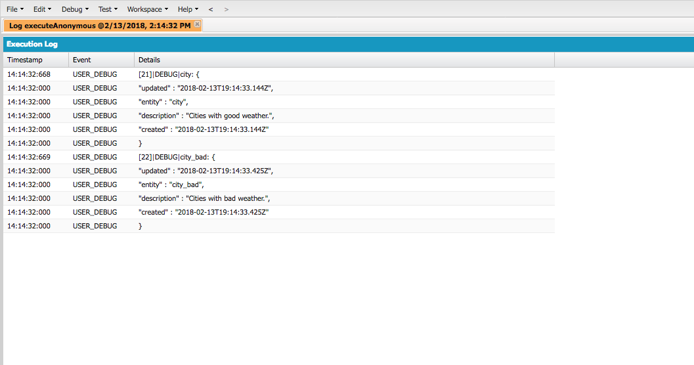

# IBM Watson Salesforce SDK - Assistant Lab

## Introduction
In this lab, you'll get the chance to try out the new Watson Salesforce SDK by interacting with the Watson Assistant API in Apex. After completing the lab, you should have a better idea of the capabilities of the Watson Assistant service and be familiar with the general structure of the SDK.

If throughout the lab you have any other questions, you can find more details about the Watson Assistant service [here](https://www.ibm.com/watson/services/conversation/). Additionally, if you're curious about any API details, you can find them in the [API explorer](https://watson-api-explorer.mybluemix.net/apis/assistant-v1). Otherwise, let's get started!

## Setup
Using the SDK requires the following setup steps:

- [Sign up/login to IBM Cloud](https://console.bluemix.net/registration/?target=/catalog/services/conversation/)
- Create desired Watson service instance
- Deploy SDK to your Salesforce org (for the lab, the quickest option will be the manual deployment to a non-scratch org)
- Set named credentials and remote site settings in Salesforce

These steps are detailed in the README of the [Watson Salesforce SDK GitHub page](https://github.com/watson-developer-cloud/salesforce-sdk).

Once those steps are complete, you should be ready to continue with the lab.

## Getting familiar with Watson Assistant
Before starting with the SDK, it'll be helpful to take a look at our new Watson Assistant service instance and get familiar with it a little bit. To do so, open the Assistant tooling. You can do this by going to the Watson section of IBM Cloud, navigating to your [**Existing Services**](https://console.bluemix.net/developer/watson/existing-services), and clicking **Launch tool**.


Once you're in the tool, you'll see a page listing the Watson Assistant **workspaces**. You'll also see that one has already been created for you called _Car Dashboard - Sample_. This is the workspace that we'll be using in this lab. Go ahead and click on it to edit it.

It might be helpful to keep this tab open to get a more visual representation of what's going on. You'll also be able to see changes/additions you make programmatically.

As a quick primer, a Watson Assistant workspace is made up of **dialog nodes** structured in a tree. Dialog nodes can recognize references to **intents** and **entities** and respond accordingly. More detailed information can be found [here](https://console.bluemix.net/docs/services/conversation/configure-workspace.html#configuring-a-conversation-workspace), but that should be enough to continue in this lab.

## Using the SDK

### 1. Getting started
Head over to the Developer Console in your Salesforce environment, where we'll be putting our Apex code to call the Watson Assistant service. You can get there by clicking on the gear icon in the top right of the Salesforce dashboard:


**After running each snippet, be sure to clear your code and start fresh for the next one.**

Before performing any actions, we need to create an instance of a Assistant object, whose class is named `IBMAssistantV1` in the Apex SDK. We can do this with just one line:

```apex
IBMAssistantV1 assistant = new IBMAssistantV1('2018-02-16');
```

The argument passed into the constructor is the version date. Using the latest version ensures the most up-to-date functionality, but the option is there to use older versions if any app-specific functionality would be broken otherwise.

Note as well that no code has to be written for authentication, as we set up the named credentials earlier in this lab. However, if we didn't set that up, we could use the `setUsernameAndPassword` method to get the same result.

### 2. Send a message to the chatbot

Let's go ahead and send a message to our chatbot:

```apex
IBMAssistantV1 assistant = new IBMAssistantV1('2018-02-16');

String message = 'Hello!';

IBMAssistantV1Models.InputData input
  = new IBMAssistantV1Models.InputDataBuilder()
    .text(message)
    .build();

IBMAssistantV1Models.MessageOptions options
  = new IBMAssistantV1Models.MessageOptionsBuilder()
    .workspaceId('WORKSPACE_ID') // Place your workspace ID here!
    .input(input)
    .build();

IBMAssistantV1Models.MessageResponse response = assistant.message(options);

String reply = response.getOutput().getText().get(0);
System.debug(String.format('MESSAGE: {0}', new String[]{ message }));
System.debug(String.format('RESPONSE: {0}\n', new String[]{ reply }));
```

Note that in the above code, a placeholder was added for the `WORKSPACE_ID` parameter of the configuration options. This is a unique value corresponding to your Watson Assistant workspace, which can be found here in the tooling:


Be sure to keep it handy, as it will be used throughout the lab for other API calls.

It's important to note the pattern here, as it's consistent across the SDK. Before calling a method, we first create an appropriately named Options class using the builder pattern. With the builder, we specify any parameters we'd like to send as options. We then pass the options variable into our method and get some model as a result. With our resulting object, we can access its properties or print it out. By default, all response models in the SDK print out in JSON, coinciding with the service response and making debugging simple.

To execute the provided code, click on the "Execute" button at the bottom of the anonymous code window. Ensure the "Open Log" option is checked. If a log window doesn't open up automatically, double-click on the top row of the "Logs" window at the bottom of the page to do so. After running the code, you should be able to see the following result in the Developer Console after checking the "Debug Only" option for the logs:

If you run this in your Developer Console, you should see something like the following output:

```
MESSAGE: Hello!
RESPONSE: Hi. It looks like a nice drive today. What would you like me to do?
```
Debug output:



### 3. Maintaining a conversation with the chatbot

Let's maintain a conversation with the chatbot to play Jazz music in the car. In order to maintain a conversation we need to carry around the `Context` object, which the Assistant service uses to follow chains of conversation.
We'll then just loop through some messages, calling the service and updating our context each time:

```apex
IBMAssistantV1 assistant = new IBMAssistantV1('2018-02-16');

// set messages and initial context
List<String> messages = new List<String> {
  'Hello!',
  'Turn on the radio.',
  'Jazz.'
};

IBMAssistantV1Models.Context context = null;

// loop through messages, printing output after each one
for (String message : messages) {
  IBMAssistantV1Models.InputData input
    = new IBMAssistantV1Models.InputDataBuilder()
      .text(message)
      .build();

  IBMAssistantV1Models.MessageOptions options
    = new IBMAssistantV1Models.MessageOptionsBuilder()
      .workspaceId('WORKSPACE_ID') // Place your workspace ID here!
      .input(input)
      .context(context)
      .build();

  IBMAssistantV1Models.MessageResponse response = assistant.message(options);

  String reply = response.getOutput().getText().get(0);
  System.debug(String.format('MESSAGE: {0}', new String[]{ message }));
  System.debug(String.format('RESPONSE: {0}\n', new String[]{ reply }));

  context = response.getContext();
}
```

If you run this in your Developer Console, you should see something like the following output:

```
MESSAGE: Hello!
RESPONSE: Hi. It looks like a nice drive today. What would you like me to do?

MESSAGE: Turn on the radio.
RESPONSE: Sure thing! Which genre would you prefer? Jazz is my personal favorite.

MESSAGE: Jazz.
RESPONSE: Great choice! Playing some jazz for you.
```


### 4. Enhancing the chatbot using the Watson Discovery service

GER: Talk about the limitations of using only Watson Assistant and when to use Discovery.


```apex
IBMAssistantV1 assistant = new IBMAssistantV1('2018-02-16');

// Create the Discovery object and set the credentials
IBMDiscoveryV1 discovery = new IBMDiscoveryV1('2017-11-07');
discovery.setUsernameAndPassword('26363d91-5710-4e54-a3d5-b98d5227014b', 'ZBEfGkDiV4qGgerman');

// Set messages and initial context
List<String> messages = new List<String> {
  'Hello!',
  'What should be my tire pressure?',
};
IBMAssistantV1Models.Context context = null;

// loop through messages, printing output after each one
for (String message : messages) {
  IBMAssistantV1Models.InputData input
    = new IBMAssistantV1Models.InputDataBuilder()
      .text(message)
      .build();
  IBMAssistantV1Models.MessageOptions options
    = new IBMAssistantV1Models.MessageOptionsBuilder()
      .workspaceId('WORKSPACE_ID') // Place your workspace ID here!
      .input(input)
      .context(context)
      .build();
  IBMAssistantV1Models.MessageResponse response = assistant.message(options);

  String reply = response.getOutput().getText().get(0);

  if (response.getOutput().getActions().get('call_discovery)) {
    IBMDiscoveryV1Models.QueryOptions options
      = new IBMDiscoveryV1Models.QueryOptionsBuilder()
        .environmentId('ea601619-610a-4ffe-9e0b-bc142d26f839')
        .collectionId('f7eb7c07-a546-4eee-9263-bf2325737ffa')
        .naturalLanguageQuery(message)
        .count(5)
        .build();
    IBMDiscoveryV1Models.QueryResponse response = discovery.query(options);
    reply = response.toString();
  }

  System.debug(String.format('MESSAGE: {0}', new String[]{ message }));
  System.debug(String.format('RESPONSE: {0}\n', new String[]{ reply }));

  context = response.getContext();
}
```

If you run this in your Developer Console, you should see something like the following output:

```
MESSAGE: Hello!
RESPONSE: Hi. It looks like a nice drive today. What would you like me to do?

MESSAGE: What should be my tire pressure?
RESPONSE: Discovery query response...
```

## Conclusion
Congratulations! You've completed the lab and hopefully feel more familiar with the Watson Salesforce SDK and navigating IBM Cloud to create and manage your Watson services. We hope that the new SDK will make it easy to integrate Watson into your Salesforce apps by offering a simple, consistent interface.

If you're interested in exploring further or would like some resources to reference in the future, below are some helpful links:

- [**IBM Cloud console**](https://console.bluemix.net/) - Where to create and manage Watson services
- [**Watson documentation**](https://console.bluemix.net/developer/watson/documentation) - Where to find all documentation on the various Watson services
- [**Watson API explorer**](https://watson-api-explorer.mybluemix.net/) - Where to see detailed API information and make sample calls
- [**Watson APIs GitHub Organization**](https://github.com/watson-developer-cloud) - Public GitHub organization containing other SDKs, starter kits, etc.