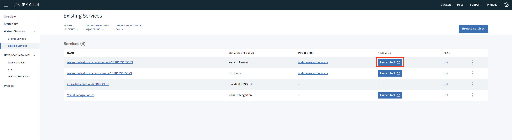
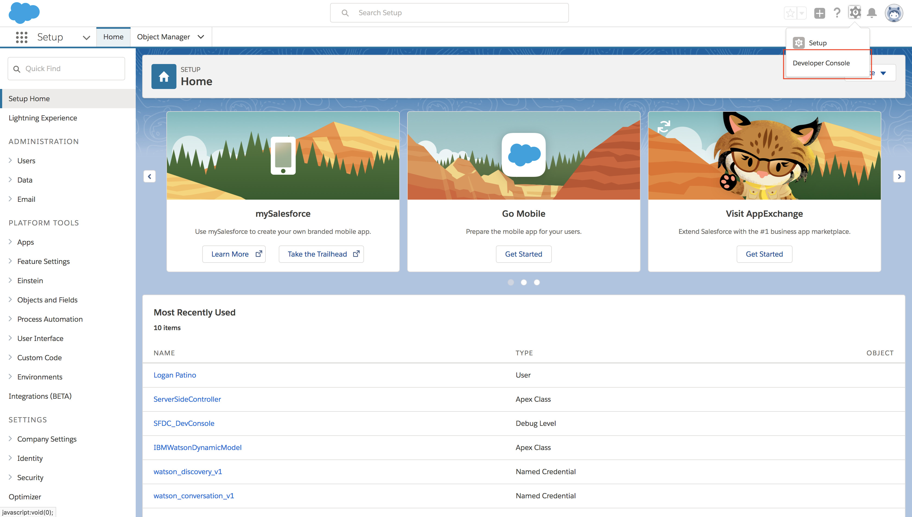
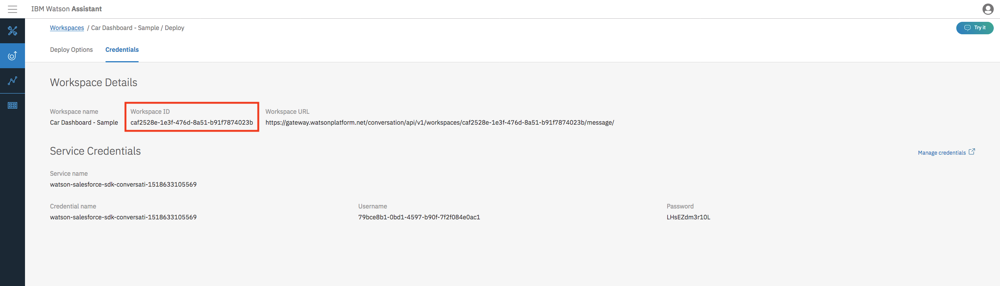
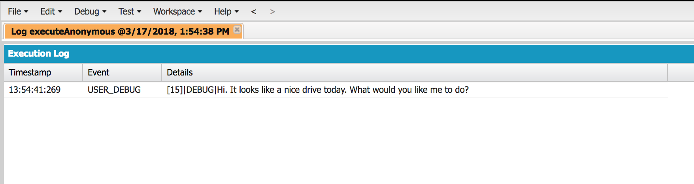
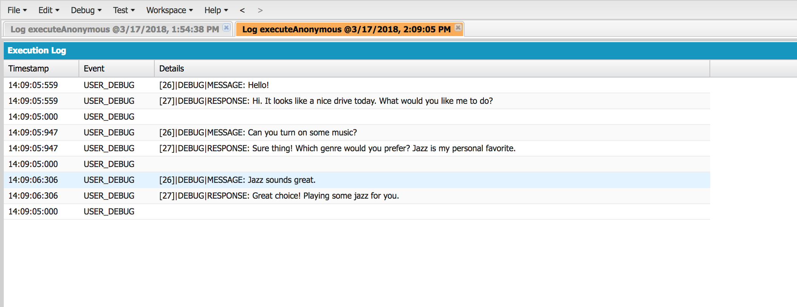
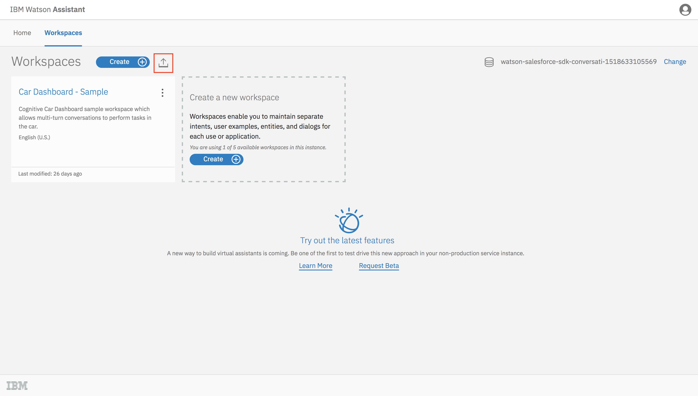
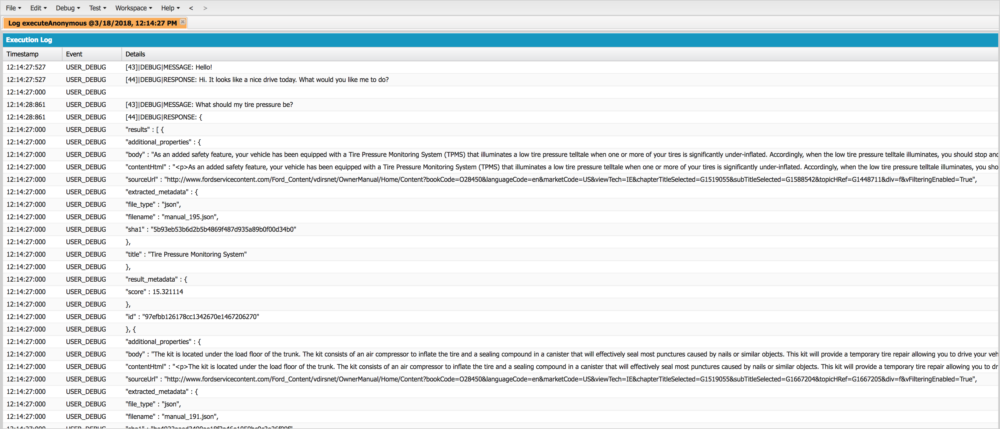

# IBM Watson Salesforce SDK - Assistant Lab

## Introduction
In this lab, you'll get the chance to try out the new Watson Salesforce SDK by interacting with the Watson Assistant API in Apex. After completing the lab, you should have a better idea of the capabilities of the Watson Assistant service and be familiar with the general structure of the SDK.

If throughout the lab you have any other questions, you can find more details about the Watson Assistant service [here](https://www.ibm.com/watson/services/conversation/). Additionally, if you're curious about any API details, you can find them in the [API explorer](https://watson-api-explorer.mybluemix.net/apis/assistant-v1). Otherwise, let's get started!

## Setup
Using the SDK requires the following setup steps:

- [Sign up/login to IBM Cloud](https://console.bluemix.net/registration/?target=/catalog/services/conversation/)
- Create desired Watson service instance
- Deploy SDK to your Salesforce org (for the lab, the quickest option will be the manual deployment to a non-scratch org)
- Set named credentials and remote site settings in Salesforce

These steps are detailed in the README of the [Watson Salesforce SDK GitHub page](https://github.com/watson-developer-cloud/salesforce-sdk).

Once those steps are complete, you should be ready to continue with the lab.

## Getting familiar with Watson Assistant
Before starting with the SDK, it'll be helpful to take a look at our new Watson Assistant service instance and get familiar with it a little bit. To do so, open the Assistant tooling. You can do this by going to the Watson section of IBM Cloud, navigating to your [**Existing Services**](https://console.bluemix.net/developer/watson/existing-services), and clicking **Launch tool**.



Once you're in the tool, you'll see a page listing the Watson Assistant **workspaces**. You'll also see that one has already been created for you called _Car Dashboard - Sample_. This is the workspace that we'll be using in this lab. Go ahead and click on it to edit it.

This sample workspace is designed to mimic a smart car assistant that you can ask questions or issue commands to while driving. With that in mind, let's get started talking to our smart car assistant.

## Using the SDK
### 1. Sending Your First Message
To get started, we'll send a simple message to the Watson Assistant service and get a response back, to get a feel for working with the SDK. Head over to the Developer Console in your Salesforce environment, where we'll be putting our Apex code to call the Assistant service. You can get there by clicking on the gear icon in the top right of the Salesforce dashboard:



**After running each snippet, be sure to clear your code and start fresh for the next one.**

Before performing any actions, we need to create an instance of an Assistant object, whose class is named IBMAssistantV1 in the Apex SDK. We can do this with just one line:

```apex
IBMAssistantV1 assistant = new IBMAssistantV1('2018-02-16');
```

The argument passed into the constructor is the API version date, the latest of which you can find at the top of the [Assistant API reference](https://www.ibm.com/watson/developercloud/assistant/api/v1). Using the latest version ensures the most up-to-date functionality, but the option is there to use older versions if any app-specific functionality would be broken otherwise.

Note as well that no code has to be written for authentication, as we set up the named credentials earlier in this lab. However, if we didn't set that up, we could use the `setUsernameAndPassword` method to get the same result.

Our simple message will just be a "Hello!" to the smart car assistant, and we'll print out the response. Here's the full code to plug in and run:

```apex
IBMAssistantV1 assistant = new IBMAssistantV1('2018-02-16');

IBMAssistantV1Models.InputData input
  = new IBMAssistantV1Models.InputDataBuilder()
    .text('Hello!')
    .build();
IBMAssistantV1Models.MessageOptions options
  = new IBMAssistantV1Models.MessageOptionsBuilder()
    .workspaceId('WORKSPACE_ID') // Place your workspace ID here!
    .input(input)
    .build();
IBMAssistantV1Models.MessageResponse response = assistant.message(options);

String reply = response.getOutput().getText().get(0);
System.debug(reply);
```

Note that in the above code, a placeholder was added for the `workspaceId` parameter of the `MessageOptions`. This is a unique value corresponding to your Assistant workspace, which can be found here in the tooling:



Be sure to keep it handy, as it will be used throughout the lab for other API calls.

It's important to note the pattern here, as it's consistent across the SDK. Before calling a method, we first create an appropriately named Options class using the builder pattern. With the builder, we specify any parameters we'd like to send as options. We then pass the options variable into our method and get some model as a result. With our resulting object, we can access its properties or print it out. By default, all response models in the SDK print out in JSON, coinciding with the service response and making debugging simple.

To execute the provided code, click on the "Execute" button at the bottom of the anonymous code window. Ensure the "Open Log" option is checked. If a log window doesn't open up automatically, double-click on the top row of the "Logs" window at the bottom of the page to do so. After running the code, you should be able to see the following result in the Developer Console after checking the "Debug Only" option for the logs:



Congratulations! You've made your first successful Watson Assistant call using Apex. Let's continue to make this a little more interesting.

### 2. Introducing Message Context
Sending a message is nice, but a key feature of any chatbot application is being able to carry on a conversation over the course of multiple messages. The Watson Assistant service has this capability through something called a `Context` object that's passed along during the course of a conversation. This object gets dynamically populated with information to allow the service to follow a conversation.

Let's demonstrate this by modifying the code we ran in the first section. We'll send two more messages this time, making sure to pass in the `Context` as part of our `MessageOptions`. We'll also go ahead and print out each message and its response to get a full view of the conversation. Here's the tweaked code:

```apex
IBMAssistantV1 assistant = new IBMAssistantV1('2018-02-16');

// set messages and initial context
List<String> messages = new List<String> {
  'Hello!',
  'Can you turn on some music?',
  'Jazz sounds great.'
};
IBMAssistantV1Models.Context context = null;

// loop through messages, printing output after each one
for (String message : messages) {
  IBMAssistantV1Models.InputData input
    = new IBMAssistantV1Models.InputDataBuilder()
      .text(message)
      .build();
  IBMAssistantV1Models.MessageOptions options
    = new IBMAssistantV1Models.MessageOptionsBuilder()
      .workspaceId('WORKSPACE_ID') // Place your workspace ID here!
      .input(input)
      .context(context)
      .build();
  IBMAssistantV1Models.MessageResponse response = assistant.message(options);

  String reply = response.getOutput().getText().get(0);
  System.debug(String.format('MESSAGE: {0}', new String[]{ message }));
  System.debug(String.format('RESPONSE: {0}\n', new String[]{ reply }));

  context = response.getContext();
}
```

After running the above, you should see this in your logs:



As you can see by the output, passing along the `Context` allowed the service to understand that when we said "Jazz sounds great.", we were talking about music that we wanted to listen to.

With this functionality, along with other advanced features of the service, you can probably see that the building blocks are there in the Watson Assistant service to create some powerful chatbot applications. For the end of this main section of the lab, we'll demonstrate some of that by integrating our smart car assistant with the Watson Discovery service.

### 3. Integrating Watson Discovery
Integrating the Assistant service with Discovery is a typical use case meant to supplement the chatbot application. If a question is asked that the Assistant service can't answer, it will call on a pre-trained Discovery instance to query data and give a better answer. In this example, we'll be using a Discovery collection pre-trained with car manuals, allowing you to ask more detailed questions about your car. 

To get started, we're going to use a slightly different workspace. It will still be based around a smart car assistant, but it will have some extra functionality added to flag when it doesn't know something and we should query our Discovery instance.

To upload this workspace, go to the "Workspaces" section of the Watson Assistant tooling and click on the button to import a workspace, using the `workspace.json` located in this folder:



Once that's done, you can run the following code, which will analyze each response from the Watson Assistant service, checking for an action called "call_discovery". When it finds it, it will query discovery with our message and output the reply from that instead. Be sure to plug in your new workspace ID instead of the one we've been using. Note that we've already provided the credentials for our pre-trained Watson Discovery service.

```apex
IBMAssistantV1 assistant = new IBMAssistantV1('2018-02-16');

// Create the Discovery object and set the credentials
IBMDiscoveryV1 discovery = new IBMDiscoveryV1('2017-11-07');
discovery.setUsernameAndPassword('c9226893-8b38-415e-8c36-ed6ce670db3b', 'gPxACNc6t4LO');

// Set messages and initial context
List<String> messages = new List<String> {
  'Hello!',
  'What should my tire pressure be?'
};
IBMAssistantV1Models.Context context = null;

// loop through messages, printing output after each one
for (String message : messages) {
  IBMAssistantV1Models.InputData input
    = new IBMAssistantV1Models.InputDataBuilder()
      .text(message)
      .build();
  IBMAssistantV1Models.MessageOptions messageOptions
    = new IBMAssistantV1Models.MessageOptionsBuilder()
      .workspaceId('WORKSPACE_ID') // Place your workspace ID here!
      .input(input)
      .context(context)
      .build();
  IBMAssistantV1Models.MessageResponse messageResponse = assistant.message(messageOptions);

  String reply = messageResponse.getOutput().getText().get(0);
  Map<String, Object> action = (Map<String, Object>) messageResponse.getOutput().get('action');

  if (action != null && action.get('call_discovery') != null) {
    IBMDiscoveryV1Models.QueryOptions queryOptions
      = new IBMDiscoveryV1Models.QueryOptionsBuilder()
        .environmentId('6dc8e9ba-1cac-4588-967c-4ab90a705653')
        .collectionId('a7715c71-f3ef-4cf0-b3cd-bfcb5fb60427')
        .naturalLanguageQuery(message)
        .count(5)
        .build();
    IBMDiscoveryV1Models.QueryResponse queryResponse = discovery.query(queryOptions);
    reply = queryResponse.toString();
  }

  System.debug(String.format('MESSAGE: {0}', new String[]{ message }));
  System.debug(String.format('RESPONSE: {0}\n', new String[]{ reply }));

  context = messageResponse.getContext();
}
```

After running that, you should see something like the following in your developer console:



You should be able to see that information has come back related to our question about tire pressure, which can be parsed further to be presented cleanly to the user.

## Conclusion
Congratulations! You've completed the lab and hopefully feel more familiar with the Watson Salesforce SDK and navigating IBM Cloud to create and manage your Watson services. We hope that the new SDK will make it easy to integrate Watson into your Salesforce apps by offering a simple, consistent interface.

If you're interested in exploring further or would like some resources to reference in the future, below are some helpful links:

- [**IBM Cloud console**](https://console.bluemix.net/) - Where to create and manage Watson services
- [**Watson documentation**](https://console.bluemix.net/developer/watson/documentation) - Where to find all documentation on the various Watson services
- [**Watson API explorer**](https://watson-api-explorer.mybluemix.net/) - Where to see detailed API information and make sample calls
- [**Watson APIs GitHub Organization**](https://github.com/watson-developer-cloud) - Public GitHub organization containing other SDKs, starter kits, etc.