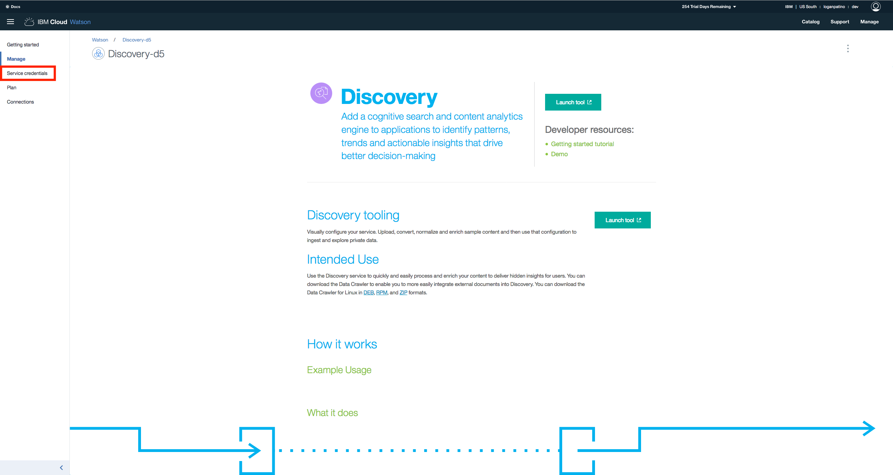
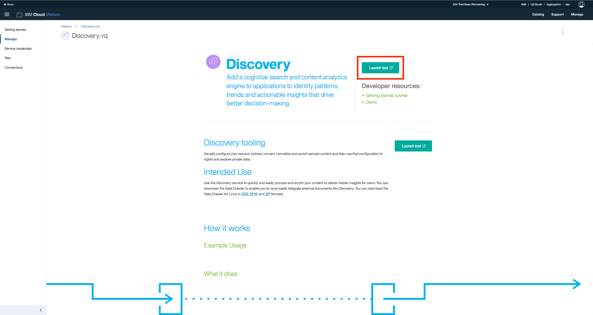
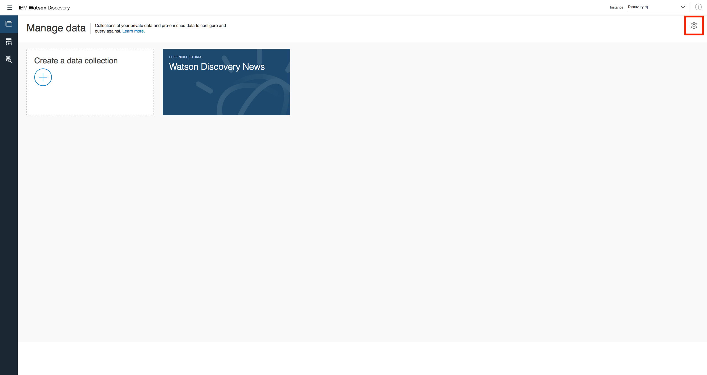
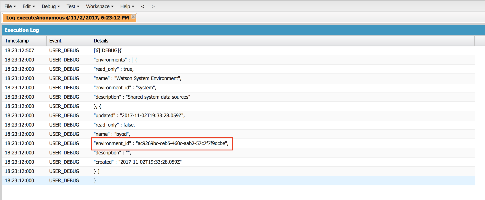
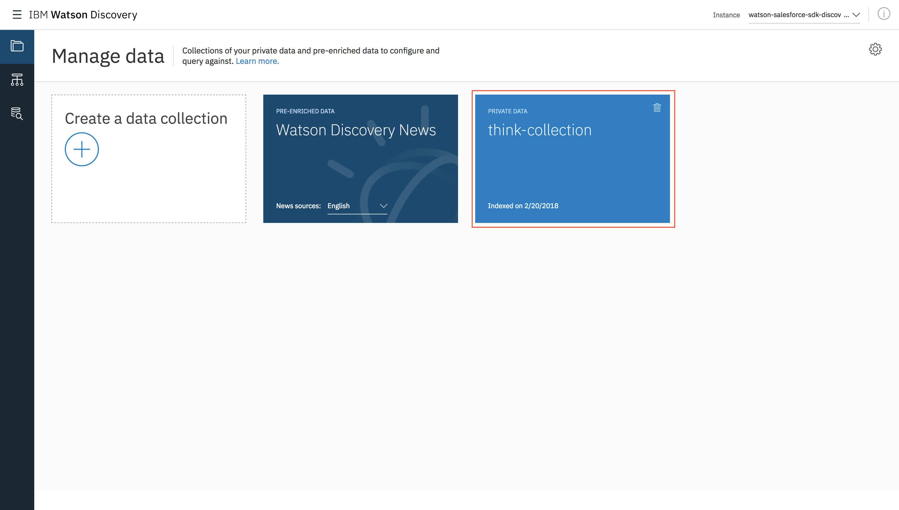

# Discovery Lab

## Introduction
In this lab, you'll get the chance to try out the new Watson Salesforce SDK by interacting with the Watson Discovery API in Apex. After completing the lab, you should be familiar with:

 - Instantiating a Watson service instance in IBM Cloud
 - Deploying the Watson Salesforce SDK to your Salesforce org
 - Using the Watson Discovery API with Apex

 If throughout the lab you have any other questions, you can find more details about the Discovery service [here](https://www.ibm.com/watson/services/discovery/). Otherwise, let's get started!

## Setup
### IBM Cloud
To get started using any Watson service, you need to first create it and get the credentials in IBM Cloud, which up until recently was named Bluemix. If you already have an IBM Cloud account, log in [here](https://console.bluemix.net/registration/?target=/catalog/services/discovery&cm_mmc=OSocial_Wechat-_-Watson+Core_Watson+Core+-+Platform-_-WW_WW-_-salesforce&cm_mmca1=000000OF&cm_mmca2=10000409&) to be taken straight to the Discovery service creation page. If you do not yet have an account, create one and follow the above link again after receiving the confirmation email.

Once you're at the service creation page, you can click "Create" on the bottom right to instantiate your Discovery service. 


Now that we have an instance, we're first going to grab some of the credentials that we'll need to use to use later when authenticating with the SDK. To find those credentials, click on the "Service credentials" menu item:



From this page, click on the "New credential" button. Don't worry about filling in any extra information. You should now be able to view your new credential to get your username and password. Make note of them or keep this tab open for later.

Next, we're going to create a Discovery environment to hold our data collections. Go back to the previous page and click the "Launch tool" button in the center of the screen to get to the Discovery tooling. Here is where you can upload documents in different collections to query.



To create your environment, click on the gear icon at the top-right of the page.



When prompted to create a collection, go ahead and exit out of the prompt. We'll do that through the SDK later on. First though, we'll need to get things set up in our Salesforce environment.

### Salesforce
[Log in](https://login.salesforce.com/) to your Salesforce developer environment, and then follow the instructions on the [Watson Salesforce SDK GitHub page]() - **need link** - README to deploy the SDK to your developer org. Automatic and manual deployment using Salesforce DX are both supported, as well as manual deployment using Ant.

Now, you should have all of the SDK classes loaded into your developer environment. The last piece of setup is adding your Discovery credentials to authenticate with the service. The preferred way to add these is using named credentials, and you can also find the instructions for this in the SDK README.

Now it's time to start using the SDK!

## Using the SDK
Head over to the Developer Console in your Salesforce, where we'll be putting our Apex code to call the Discovery service. For most of the Discovery methods, we need to supply an environment ID. This corresponds to the environment we created in the Discovery tooling in the setup portion of this lab. Lucky for us, the SDK provides a `listEnvironments` method to get that ID.

**Note:** If at any point in the coding section you would like to take a closer look at the many API endpoints and models in the Discovery service, you can go to the [Discovery API explorer](https://watson-api-explorer.mybluemix.net/apis/discovery-v1). This is a handy resource for future use, allowing you to see all of the operations, sample requests and responses, and to make sample API calls by inputting your credentials at the top of the page.

Before performing any actions, we need to create an instance of a Discovery object, whose class is named `IBMDiscoveryV1` in the Apex SDK. We can do this with just one line:

```apex
IBMDiscoveryV1 discovery = new IBMDiscoveryV1(IBMDiscoveryV1.VERSION_DATE_2017_09_01);
```

The argument passed into the constructor is the version date, and the possible values are exposed as static `String`s in the service classes. Using the latest version ensures the most up-to-date functionality, but the option is there to use older versions if any app-specific functionality would be broken otherwise.

Note as well that no code has to be written for authentication, as we set up the named credentials earlier in this lab. However, if we didn't set that up, we could use the `setUsernameAndPassword` method to get the same result.

Now, we can use our new `discovery` object to make the `listEnvironments` call. This can be done with the following code:

```apex
IBMDiscoveryV1Models.ListEnvironmentsOptions options 
  = new IBMDiscoveryV1Models.ListEnvironmentsOptionsBuilder().build();
IBMDiscoveryV1Models.ListEnvironmentsResponse response 
  = discovery.listEnvironments(options);
```

It's important to note the pattern here, as it's consistent across the SDK. Before calling a method, we first create an appropriately named `Options` class using the builder pattern. With the builder, we specify any parameters we'd like to send as options. We then pass the options variable into our method and get some model as a result. In this particular example, we didn't send any additional options, but the pattern will become more apparent as we go through the lab.

Now that we have our resulting object, we can access its properties or print it out. By default, all response models in the SDK print out in JSON, coinciding with the service response and making debugging simple. To demonstrate, we'll print out our `ListEnvironmentsResponse` model and see what came back from the service:

```apex
System.debug(response);
```

Be sure to check the "Debug Only" option to see only the desired output. After putting the above code together and executing, you should see something like the following, with the highlighted property the desired ID. Be sure to write this down for later use.



Congratulations! You've made your first successful Watson Discovery call using Apex in just 4 lines of code. Let's continue exploring more of the Discovery API.

When you created your Discovery service, you may have noticed that you already had a collection present: the Discovery News collection. This is a default collection that consists of millions English news documents and is updated continuously. We'll use this pre-built collection to test out Discovery's querying functionality and get a better idea of its capabilities.

There are two ways to make queries in Discovery: with the Discovery Query Language or using natural language. You can learn more about using the Discovery Query Language [here](https://console.bluemix.net/docs/services/discovery/using.html#building-a-basic-query). For this first demonstration, we'll use natural language, along with some other parameters, to search for relevant documents about Dreamforce 2017.

Remove all of the previous code, other than the first line instantiating the Discovery object, and replace it with the following:

```apex
IBMDiscoveryV1Models.QueryOptions options 
  = new IBMDiscoveryV1Models.QueryOptionsBuilder()
    .environmentId('system')
    .collectionId('news')
    .naturalLanguageQuery('Dreamforce 2017')
    .count(5)
    .build();
IBMDiscoveryV1Models.QueryResponse response = discovery.query(options);
System.debug(response);
```

Note how, like in the first code example, we follow the pattern of creating an `Options` object with a builder and then pass that into our Discovery method. In this case, we actually use the builder to set the environment ID and collection ID (which are defaults for the Discovery News collection), natural language query, and count of the number of documents we want back.

If you take a look at the logged output, you'll see that there's _a lot_ of information, some of it we may not be interested in. Luckily, the `QueryOptions` allow us to pass a list of fields we want back. Let's add that parameter to the builder and look at the new output.

```apex
  .returnField(new List<String> { 'text', 'author', 'url' })
```

Now we just get a list of returned documents with the text, author, and URL for each, if applicable, which is much easier to deal with.

Easily parsing your service response is one of the biggest advantages of using the SDK, since everything is wrapped up in objects. We can demonstrate this with the first Discovery News query by manipulating our response object instead of just printing it.

If we take a look at the `query` method in the [API explorer](https://watson-api-explorer.mybluemix.net/apis/discovery-v1#!/Queries/query), we can see that our response contains an array of `QueryResult` objects, each of which has 4 properties: `id`, `score`, `metadata`, and `collection_id`. We can verify the specifics by looking at the `QueryResponse` and `QueryResult` objects in the `IBMDiscoveryV1Models` class of the SDK, which contains all of the models used for the Discovery service.

Knowing this, let's print out the document ID of the 5 documents we get back from our query, using the following code:

```apex
IBMDiscoveryV1Models.QueryOptions options 
  = new IBMDiscoveryV1Models.QueryOptionsBuilder()
    .environmentId('system')
    .collectionId('news')
    .naturalLanguageQuery('Dreamforce 2017')
    .count(5)
    .build();
IBMDiscoveryV1Models.QueryResponse response = discovery.query(options);

List<IBMDiscoveryV1Models.QueryResult> results = response.getResults();
for (IBMDiscoveryV1Models.QueryResult result : results) {
  System.debug(result.getId());
}
```

Now, you should just see the IDs of the returned documents.

Since you're a bit more familiar with the Discovery service and the SDK, let's create our own collection to upload documents into and query. To do so, we'll use the `createCollection` method. By now you should get the idea of the pattern to build this request, so if you're feeling confident, go ahead and try it yourself, using the API explorer and the `IBMDiscoveryV1` and `IBMDiscoveryV1Models` classes as reference. Otherwise, here's the code we need to do it:

```apex
IBMDiscoveryV1Models.CreateCollectionOptions options 
  = new IBMDiscoveryV1Models.CreateCollectionOptionsBuilder()
    .environmentId('ENVIRONMENT_ID') // enter your environment ID here!
    .name('dreamforce-collection')
    .description('Collection created at Dreamforce 2017')
    .build();
IBMDiscoveryV1Models.Collection response = discovery.createCollection(options);
```

**Note:** Be sure to use the environment ID you got in your `listEnvironments` call earlier in the lab!

If you print out your response object, you should see the details of your newly created collection. Like the environment ID, be sure to keep a note of the returned collection ID, as it will be used when uploading documents and querying. If you'd like extra verification that this worked, head back over to the Discovery tooling, where you first created your environment. Alongside the default Discovery News collection, you should see a collection named "dreamforce-collection".



With our new collection, we're now going to upload some documents to it to be able to analyze them. If you look in the `examples/discovery/sample_documents` folder, you'll see that we've provided 10 sample documents, each containing the bio of a Dreamforce 2017 speaker pulled from the Dreamforce website. These are what we'll be using to populate our collection.

The easiest way to upload a small set of local documents is to use the tooling, which allows you to drag-and-drop a set of documents into your collection. However, for the purpose of this lab, we'll do the same through the SDK, which allows developers the ablity to upload documents programmatically or to create their own upload interfaces.

- Upload some documents
- Query those documents


## Conclusion
Final words, maybe helpful links to check out for later.