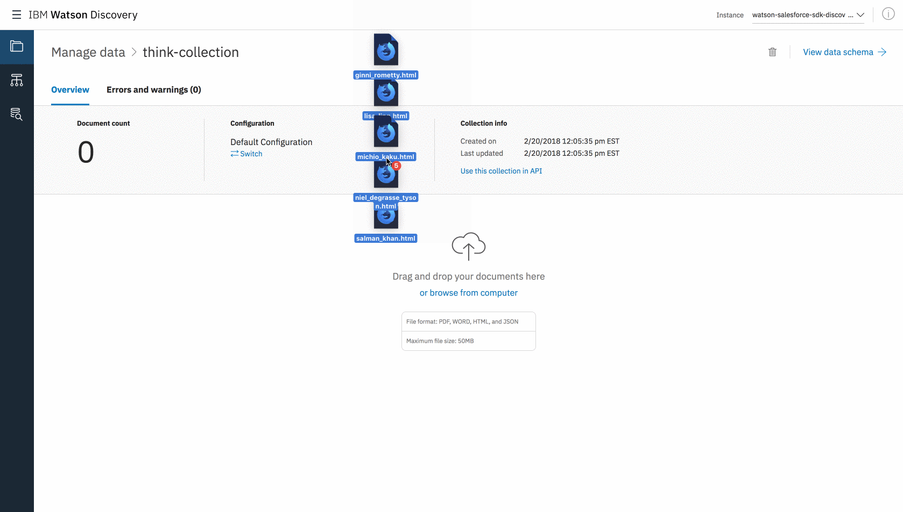
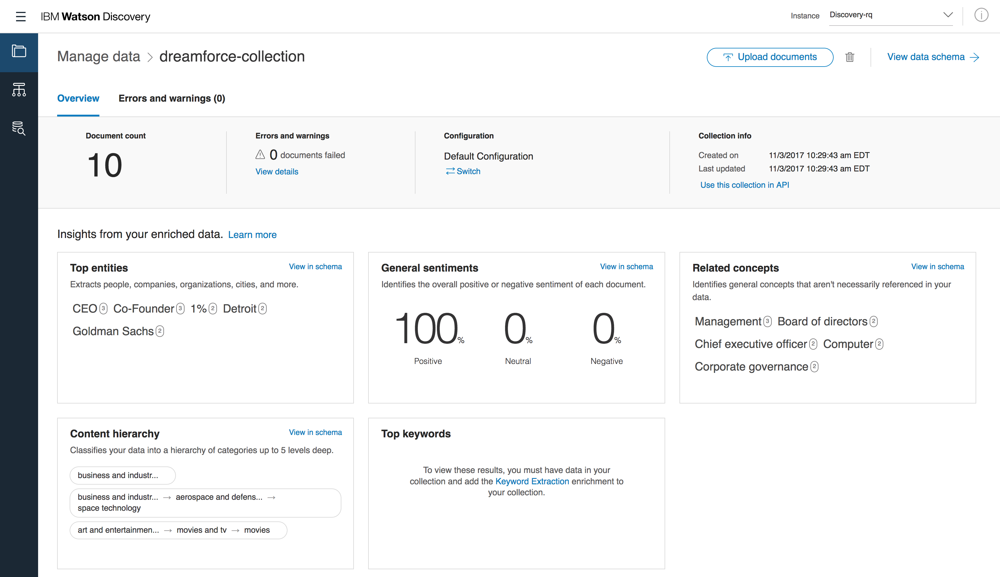

# IBM Watson Salesforce SDK - Discovery Lab

## Introduction
In this lab, you'll get the chance to try out the new Watson Salesforce SDK by interacting with the Watson Discovery API in Apex. After completing the lab, you should have a better idea of the capabilities of the Watson Discovery service and be familiar with the general structure of the SDK.

If throughout the lab you have any other questions, you can find more details about the Discovery service [here](https://www.ibm.com/watson/services/discovery/). Otherwise, let's get started!

## Setup

Using the SDK requires the following setup steps:

- Sign up/login to IBM Cloud
- Create desired Watson service instance
- Deploy SDK to your Salesforce org (for the lab, the quickest option will be the manual deployment to a non-scratch org)
- Set named credentials and remote site settings in Salesforce

These steps are detailed in the README of the [Watson Salesforce SDK GitHub page](https://github.com/watson-developer-cloud/salesforce-sdk).

Once those steps are complete, you should be ready to continue with the lab.

## Using the SDK
### 1. Listing Environments
Head over to the Developer Console in your Salesforce environment, where we'll be putting our Apex code to call the Discovery service. You can get there by clicking on the gear icon in the top right of the Salesforce dashboard:


**After running each snippet, be sure to clear your code and start fresh for the next one.** For most of the Discovery methods, we need to supply an environment ID. 

Before going further, it's helpful to understand the structure of the Watson Discovery service. As a user, you upload documents to your Discovery service, which you can later query and analyze. Those documents are stored in **collections**. These can be thought of as boxes of related data. We then can package multiple boxes, or collections, into something like a warehouse, which in Discovery is an **environment**. 

Each collection and environment has a unique ID, and it's an environment ID that we're interested in retrieving now. Lucky for us, the SDK provides a `listEnvironments` method to get that ID.

**Note:** If at any point in the coding section you would like to take a closer look at the many API endpoints and models in the Discovery service, you can go to the [Discovery API explorer](https://watson-api-explorer.mybluemix.net/apis/discovery-v1). This is a handy resource for future use, allowing you to see all of the operations, sample requests and responses, and to make sample API calls by inputting your credentials at the top of the page.

Before performing any actions, we need to create an instance of a Discovery object, whose class is named `IBMDiscoveryV1` in the Apex SDK. We can do this with just one line:

```apex
IBMDiscoveryV1 discovery = new IBMDiscoveryV1(IBMDiscoveryV1.VERSION_DATE_2017_09_01);
```

The argument passed into the constructor is the version date, and the possible values are exposed as static strings in the service classes. Using the latest version ensures the most up-to-date functionality, but the option is there to use older versions if any app-specific functionality would be broken otherwise.

Note as well that no code has to be written for authentication, as we set up the named credentials earlier in this lab. However, if we didn't set that up, we could use the `setUsernameAndPassword` method to get the same result.

Now, we can use our new `discovery` object to make the `listEnvironments` call. This can be done by running the following code:

```apex
IBMDiscoveryV1 discovery = new IBMDiscoveryV1(IBMDiscoveryV1.VERSION_DATE_2017_09_01);

IBMDiscoveryV1Models.ListEnvironmentsOptions options 
  = new IBMDiscoveryV1Models.ListEnvironmentsOptionsBuilder().build();
IBMDiscoveryV1Models.ListEnvironmentsResponse response 
  = discovery.listEnvironments(options);

System.debug(response);
```

It's important to note the pattern here, as it's consistent across the SDK. Before calling a method, we first create an appropriately named `Options` class using the builder pattern. With the builder, we specify any parameters we'd like to send as options. We then pass the options variable into our method and get some model as a result. In this particular example, we didn't send any additional options, but the pattern will become more apparent as we go through the lab.

Now that we have our resulting object, we can access its properties or print it out. By default, all response models in the SDK print out in JSON, coinciding with the service response and making debugging simple. At the end of the above code, we print out our `ListEnvironmentsResponse` model to see what came back from the service.

To execute the provided code, click on the "Execute" button at the bottom of the anonymous code window. Ensure the "Open Log" option is checked. If a log window doesn't open up automatically, double-click on the top row of the "Logs" window at the bottom of the page to do so. Be sure to check the "Debug Only" option to see only the desired output. After execution, you should see something like the following, with the highlighted property the desired ID. Be sure to write this down for later use.


Congratulations! You've made your first successful Watson Discovery call using Apex in just 4 lines of code. Let's continue exploring more of the Discovery API.

### 2. Querying the Discovery News Collection
When you created your Discovery service, you may have noticed that you already had a collection present: the Discovery News collection. This is a default collection that consists of millions English news documents and is updated continuously. We'll use this pre-built collection to test out Discovery's querying functionality and get a better idea of its capabilities.

There are two ways to make queries in Discovery: with the Discovery Query Language or using natural language. You can learn more about using the Discovery Query Language [here](https://console.bluemix.net/docs/services/discovery/using.html#building-a-basic-query). For this first demonstration, we'll use natural language, along with some other parameters, to search for relevant documents about Dreamforce 2017.

Remove all of the previous code and replace it with the following:

```apex
IBMDiscoveryV1 discovery = new IBMDiscoveryV1(IBMDiscoveryV1.VERSION_DATE_2017_09_01);

IBMDiscoveryV1Models.QueryOptions options 
  = new IBMDiscoveryV1Models.QueryOptionsBuilder()
    .environmentId('system')
    .collectionId('news')
    .naturalLanguageQuery('IBM Think 2018')
    .count(5)
    .build();
IBMDiscoveryV1Models.QueryResponse response = discovery.query(options);

System.debug(response);
```

Note how, like in the first code example, we follow the pattern of creating an `Options` object with a builder and then pass that into our Discovery method. In this case, we actually use the builder to set the environment ID and collection ID (which are defaults for the Discovery News collection), natural language query, and count of the number of documents we want back.

If you take a look at the logged output, you'll see that there's _a lot_ of information, some of it we may not be interested in. Luckily, the `QueryOptions` allow us to pass a list of fields we want back. Let's add that parameter to the builder with the following line:

```apex
  .returnField(new List<String> { 'text', 'author', 'url' })
```

With that added, run all of the code together. Now we just get a list of returned documents with the text, author, and URL for each, if applicable, which is much easier to deal with.

### 3. Manipulating SDK Models

Easily parsing your service response is one of the biggest advantages of using the SDK, since everything is wrapped up in objects. We can demonstrate this with the first Discovery News query by manipulating our response object instead of just printing it.

If we take a look at the `query` method in the [API explorer](https://watson-api-explorer.mybluemix.net/apis/discovery-v1#!/Queries/query), we can see that our response contains an array of `QueryResult` objects, each of which has 4 properties: `id`, `score`, `metadata`, and `collection_id`. We can verify the specifics by looking at the `QueryResponse` and `QueryResult` objects in the `IBMDiscoveryV1Models` class of the SDK, which contains all of the models used for the Discovery service.

Knowing this, let's print out the document ID of the 5 documents we get back from our query, using the following code:

```apex
IBMDiscoveryV1 discovery = new IBMDiscoveryV1(IBMDiscoveryV1.VERSION_DATE_2017_09_01);

IBMDiscoveryV1Models.QueryOptions options 
  = new IBMDiscoveryV1Models.QueryOptionsBuilder()
    .environmentId('system')
    .collectionId('news')
    .naturalLanguageQuery('IBM Think 2018')
    .count(5)
    .build();
IBMDiscoveryV1Models.QueryResponse response = discovery.query(options);

List<IBMDiscoveryV1Models.QueryResult> results = response.getResults();
for (IBMDiscoveryV1Models.QueryResult result : results) {
  System.debug(result.getId());
}
```

Now, you should just see the IDs of the returned documents.

### 4. Creating a New Collection
Since you're a bit more familiar with the Discovery service and the SDK, let's create our own collection to upload documents into and query. To do so, we'll use the `createCollection` method. By now you should get the idea of the pattern to build this request, so if you're feeling confident, go ahead and try it yourself, using the API explorer and the `IBMDiscoveryV1` and `IBMDiscoveryV1Models` classes as reference. Otherwise, here's the code we need to do it:

```apex
IBMDiscoveryV1 discovery = new IBMDiscoveryV1(IBMDiscoveryV1.VERSION_DATE_2017_09_01);

IBMDiscoveryV1Models.CreateCollectionOptions options 
  = new IBMDiscoveryV1Models.CreateCollectionOptionsBuilder()
    .environmentId('ENVIRONMENT_ID') // enter your environment ID here!
    .name('think-collection')
    .description('My custom collection')
    .build();
IBMDiscoveryV1Models.Collection response = discovery.createCollection(options);
```

**Note:** Be sure to use the environment ID you got in your `listEnvironments` call earlier in the lab!

If you print out your response object, you should see the details of your newly created collection. Like the environment ID, be sure to keep a note of the returned collection ID, as it will be used when uploading documents and querying. If you'd like extra verification that this worked, head back over to the Discovery tooling. This is a visual way to add and query your Discovery documents on the IBM Cloud platform. You can click [here](https://console.bluemix.net/dashboard/apps/) and then click on your Discovery service and the "Launch tool" button to open up the tooling. If you need to log in, remember to use the credentials in the "Setup" section of this lab.

Once you get there, you should see the default Discovery News collection and your new collection named "think-collection".


### 5. Uploading Documents
With our new collection, we're now going to upload some documents to it to be able to analyze them. If you look in the `examples/discovery/sample_documents` folder, you'll see that we've provided 5 sample documents, each containing the bio of an IBM Think 2018 speaker. These are what we'll be using to populate our collection.

The easiest way to upload a small set of local documents is to use the tooling, which allows you to drag-and-drop a set of documents into your collection. This functionality is available through the SDK, allowing developers the ablity to upload documents programmatically or to create their own upload interfaces, but for the purpose of this lab, we're going to go with the simpler route.

In the tooling page where you see the Discovery News collection and your custom "think-collection", click on your custom collection. From here simply grab the 5 sample documents and drag them into your browser window:

<p align="center">
  
</p>

After a little bit of processing, you should be taken to the following page, which confirms that the documents have been successfully processed. From here, you can also look at some extracted insights from your data and view the data schema or build queries using the tabs on the left sidebar.



### 6. Querying our Custom Data
In our case, we're going to make a query using the SDK again, this time using the Discovery Query Language. Our goal will be to pick out documents which contain the `entity` IBM, which should return to us the speakers who have some connection to the company. To make things easier to digest, we'll filter for just the extracted title of each document, using dot notation to navigate the full JSON response. Paste the following into your developer console, again making sure to substitute your personal environment and collection IDs:

```apex
IBMDiscoveryV1 discovery = new IBMDiscoveryV1(IBMDiscoveryV1.VERSION_DATE_2017_09_01);

IBMDiscoveryV1Models.QueryOptions options 
  = new IBMDiscoveryV1Models.QueryOptionsBuilder()
    .environmentId('ENVIRONMENT_ID')
    .collectionId('COLLECTION_ID')
    .query('enriched_text.entities.text:IBM')
    .returnField(new List<String> { 'extracted_metadata.title' })
    .build();
IBMDiscoveryV1Models.QueryResponse response = discovery.query(options);

System.debug(response);
```

Taking a look at the printed result, you should see 1 name returned, that name being Ginni Rometty, the IBM President and CEO.

## Conclusion
Congratulations! You've completed the lab and hopefully feel more familiar with the Watson Salesforce SDK and navigating IBM Cloud to create and manage your Watson services. We hope that the new SDK will make it easy to integrate Watson into your Salesforce apps by offering a simple, consistent interface.

If you're interested in exploring further or would like some resources to reference in the future, below are some helpful links:

- [**IBM Cloud console**](https://console.bluemix.net/) - Where to create and manage Watson services
- [**Watson documentation**](https://console.bluemix.net/developer/watson/documentation) - Where to find all documentation on the various Watson services
- [**Watson API explorer**](https://watson-api-explorer.mybluemix.net/) - Where to see detailed API information and make sample calls
- [**Watson APIs GitHub Organization**](https://github.com/watson-developer-cloud) - Public GitHub organization containing other SDKs, starter kits, etc.
